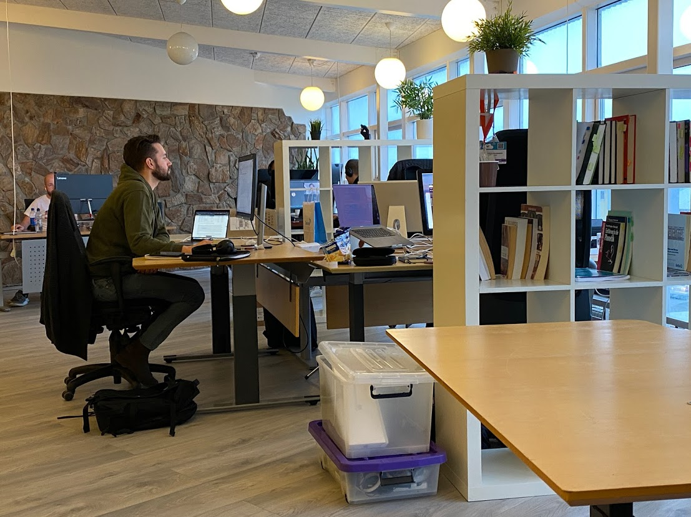

# Sköpunarmiðstöð

**Sköpunarmiðstöð er staður sem dregur fólk saman til að skapa á, og getur ef vel tekst til, myndað samfélag sem verður jarðvegur fyrir nýsköpun. Hér verður hugtakið notað yfir ýmis frumkvæði sem kölluð hafa verið „samvinnurými“, „þróunarsetur“ og „smiðjur“. Uppskriftin „sköpunarmiðstöð“ er nokkuð þekkt og kemur fyrir í ýmsu samhengi.**

Sköpunarmiðstöð er staður þar sem fólk kemur saman til að vinna og skapa, yfirleitt án þess að vinnan innan sömu skipulagsheildar, s.s. fyrirtæki eða stofnun. Í miðstöðinni getur verið samvinnurými, s.s. skrifborð og stólar sem notendur geta nýtt, eða prívat skrifstofherbergi. Gjarnan eru sameiginleg rými s.s. fundaraðstaða, smiðjur eða stúdíó sem hentar til ólíkrar sköpunar.

::: info Breið samvinnurými á Akranesi

Mynd: Breið þróunarfélag
:::

## Hvað er sköpunarmiðstöð?

### Ekki skrifstofuhótel

Fljótt á litið gæti virst lítill munur á sköpunarmiðstöð og því sem kallað hefur „skrifstofuhótel“. Á þessu er þó mikill munur sem felst í tilgangi starfseminnar. Í sköpunarmiðstöð er megin tilgangurinn að mynda samfélag, þar sem tengsl notenda sín á milli er aðalatriðið. Skrifstofuaðstaðan er í raun meðalið, ekki tilgangurinn, og leið til að stefna fólki saman sem annars væri einangrað, eða væri jafnvel í einhverju öðru byggðarlagi.

Það væri því mikil mistök að líta svo á að sköpunarmiðstöð sé tilbúin þegar búið er að stilla upp skrifborðum, tengja ljósleiðara og koma fyrir kaffivélinni. Þetta er í raun aðeins fyrsta skref. Í flestunum tilfellum þarf einhverskonar gestgjafa til að vinna að því laða fólk að, skapa rétta stemningu, tengja fólk og ljá staðnum sína eigin merkingu umfram einungis aðstöðu til að vinna.

### Þema og sérhæfing

Þema og nálgun hverrar miðstöðvar þarf að haga eftir aðstæðum hverju sinni. Í Reykjavík starfrækir t.d. [Íslenski sjárvarklasinn](https://www.sjavarklasinn.is/https:/) skrifstofuaðstöðu við gömlu höfnina, þar sem um 70 fyrirtæki og frumkvöðlar í „hafsækinni starfsemi“ vinna á sama stað, meðan [hafnar.haus](https://hafnar.haus) starfrækir vinnuaðstöðu fyrir meira en 200 manns í skapandi greinum hinumegin við höfnina. Sjávarklasin einbeitir sér að starfsemi tengdri sjávarútveg meðan hafnar.haus hýsir fyrst og fremst listafólk.

Það er ólíklegt að miðstöðvar úti á landi geti verið svo sérhæfðar, nema þær séu sérstaklega að miða starfsemi sína að notendum sem komi annars staðar frá. Dæmi um sérhæfða miðstöð úti á landi er [Textílmiðstöð Íslands](https://www.textilmidstod.is/) á Blönduósi, þar sem ýmis aðstaða og starfsemi til að vinna með, læra um og þróa textíl er til staðar og sótt af fólki hvaðanæva að af landinu og heiminum með áhuga á því sviði.

Ákveðin togstreita getur myndast milli þess að gera annars vegar þema miðstöðvarinnar nægilega afmarkað og einbeitt til þess að gefa notendum annars staðar að tilefni til að sækja hana heim, og hins vegar að gera skírskotun hennar nægilega breiða til að höfða til nægjanlegs fjölda fólks á smærri stöðum. Aftur er hér hægt að fara margar leiðir.

### Notendur

Á smærri stöðum er líklegt að notendur slíkra miðstöðva séu fjölbreyttur hópur. Þeir geta meðal annars verið:

- Einyrkjar og smærri fyrirtæki sem stunda skrifstofuvinnu
- Starfsmenn stofnana og fyrirtækja sem vinna störf án staðsetningar
- Stafrænir flakkarar sem ferðast um í stutta stund eða allt árið og vinna fjarvinnu samhliða ferðalögunum
- Smærri einingar, deildir og setur ýmisskonar
- Listamenn og annað skapandi fólk

### Ávinningur

Það sem notendur slíkra miðstöðva eru að leitast eftir getur meðal annars verið:

- **Sveigjanleg skrifstofuaðstaða** þar sem séð er um ýmsa þætti, s.s. internet, þrif, kaffi, o.sfrv.
- **Félagsskapur**, þ.e. einhverja til að spjalla við í kaffipásum í stað þess að vinna einangrað við eldhúsborð eða litlum vinnustað
- **Faglegt tenglsanet**, sem getur leitt til þekkingaryfirfærslu, samstarfs og verkefna. Á þeim miðstöðum sem hafa skýrt afmarkað þema getur miðstöðin verið lykill að aðgengi í ákveðinn bransa

Samfélagslegur ávinningur miðstöðvanna sjálfra getur verið:

- Aukið flæði hugmynda, hæfileika og samstarfs milli aðila með tengslaneti
- Meira aðgengi inn í samfélagið á staðnum: Nýtt fólk hefur stað það sem hægt er að kynnast öðrum
- Miðpunktur samfélags og staðar, sem getur virkað sem einhverskonar kennileiti eða táknmynd

Á sumum miðstöðvum hefur verið reynt að hafa annars konar þjónustu sem sótt er af nærsamfélaginu, s.s. bókasafnsaðstöðu eða einhverskonar móttöku fyrir aðra þjónustuaðila. Þetta hefur þann kost að opna dyrnar fyrir fjölbreyttari hluta samfélagsins en þá sem þurfa á skrifstofuaðstöðu að halda. Þá er stundum jafnframt aðstaða til að halda viðburði og opin hús, sem getur aftur hjálpað til við að auka aðgengilega og gagnsæi staðarins fyrir samfélagið allt.

## Verkefni gestgjafa

### Fjárfest í fólki

Eins og áður sagði er tilgangur sköpunarmiðstöðva fólginn í því samfélagi og samlegðaráhrifum sem myndast á staðnum. Hin efnislega umgjörð, s.s. skrifstofurými, húsgögn og tækjabúnaður er mikilvæg, en í raun aðeins grunnur að hinni óefnislegu umgjörð, þ.e. hinni samfélagslegu.

Það getur hins vegar verið vandasamt að henda reiður á þeim samfélagslegu innviðum sem myndast, og skilningur á því hvernig beri að fjárfesta í þeim er mun meira á reiki en þeim efnislegu. Á meðan að fjármagn sem fer í tæki og efnislegar eignir flokkast sem fjárfesting á bókhaldinu, og afleiðingarnar af þess háttar fjárfestingu eru sýnilegar og áþreyfanlegar, þá er mun erfiðara að sýna óefnislegar fjárfestingar og beinar afleiðingar þeirra fyrir samfélagslega uppbyggingu.

Sköpunarmiðstöðvar þurfa því einhverskonar gestgjafa. Þetta getur verið ein manneskja eða fleiri, í hlutastarfi eða fullu starfi, sjálfboðaliðar eða launafólk. Hlutverk gestgjafa er hið vandasama verk að fjárfesta í samfélagslegri uppbyggingu, hvers afleiðingar koma oft fram síðar, og ekki alltaf hægt að mæla með nákvæmum hætti. Hlutverk hans er að stuðla að samfélagi sem hvetur til nýsköpunar.

Slík samfélög eru opin og einlæg. Þau einkennast af flæði hugmynda og einstaklinga milli ólíkra skipulagsheilda. Umburðarlyndi er sýnt gagnvart ólíkum nálgunum og gagnvart mistökum.

### Að tengja og plögga

Gestgjafinn ætti að vera óhræddur við að tengja fólk saman og kynna fyrir hvort öðru. Sérstaklega á þetta auðvitað við um aðkomufólk og aðra sem hafa þörf á slíku. Að sjá til þess að allir viti af viðburðum, hvort sem er félagslegum eða faglegum, og brjóta ísinn í samskiptum þegar þess þarf.

Það kann að vera gagnlegt að halda viðburði í samræmi við þema miðstöðvarinnar. Hvort sem er óformleg partí og hittingur, eða formlegri námskeið, ráðstefnur, vinnurstofur o.s.frv. Þetta getur vakið athygli á miðstöðinni og laðað fólk að. Þá geta ýmis samstarfsverkefni tengd sviði miðstöðvarinnar verið kjörin til að koma henni á framfæri og festa mikilvægi hennar í sessi.

### Að slá tóninn

Í daglegum samskiptum slær gestgjafinn ákveðinn tón fyrir rýmið. Við það bætist ásýnd þess og andrúmsloft. Er það mjög faglegt og fyrirtækjamiðað? Er það frjálslegt og skapandi? Er það í anda stofnana eða grasrótar? Er allt spikk og span í röð og reglu, eða ber rýmið þess merki að notendur geti sjálfir hagrætt og gert það að sínu? Sérhvert rými hefur yfir sér ákveðið andrúmsloft sem ákvarðar hverjir laðast að því og ílengjast, og jafnvel hefur áhrif á hvernig samskipti og hegðun notenda eru innan þess.

**Að neðan eru tekin þrjú dæmi af mismunandi rýmum og því velt upp hvers konar samfélag þau laði að sér:**

::: info AkureyrarAkademían

Mynd: AkureyrarAkademían
:::

Umhverfið á myndinni að ofan minnir á bókasafn eða skóla, og bendir til samfélags fræða- og háskólafólks.

::: info Sköpunarmiðstöðin Stöðvarfirði

Mynd: Sköpunarmiðstöðin Stöðvarfirði
:::

Umhverfið að ofan er frjálslegt og hrátt. Þar myndi maður búast við að hitta listamenn.

::: info Vinnustofa Kjarvals

Mynd: Vinnustofa Kjarvals
:::

Íburður og glæsileiki. Umhverfið minnir á dýrt hótel. Gefur til kynna aðila úr viðskiptalífinu eða stjórnendur fyrirtækja.

### Ímynd og orðspor

Hvort sem nýttir eru samfélagsmiðlar, vefsíða eða hefðbundnari fjölmiðlar getur reynst mikilvægt að hafa miðstöðina sýnilega. Það er hluti af því að slá tóninn og ljá miðstöðinni ákveðna merkingu í hugum fólks. Þetta vekur áhuga framtíðar notenda, og jafnframt spegla núverandi notendur sig í þeirri ímynd sem miðstöðin fær og tengja sig vonandi við hana.

Þá getur athygli út af við verið ákveðin leið til þess að formfesta árangur í samfélagslegri uppbyggingu. Fyrir hagaðila getur utanaðkomandi frásögn verið staðfesting á gildi verkefnisins. Tilvalið er að nýta notendur miðstöðvarinnar og þeirra sögur til að skapa frásagnir af miðstöðinni. Segja frá því sem þeir eru að gera, nái þeir til dæmis einhverjum árangri eða áfanga, og vinna þannig með þeim til þess að miðstöðin sjálf verði hluti af sjálfsmynd notenda.

## Mæling á árangri

Beinast liggur við að mæla fjölda notenda, og hversu lengi og mikið þeir nýta sér miðstöðina. Ef viðburðir eru haldnir er hægt halda utan um fjölda þeirra og fjölda gesta. Eins og sagði áður skiptir auðvitað mest máli hvers konar samfélag myndast og samskipti þeirra á milli. Þetta getur verið erfitt að mæla á megindlegan hátt, en hægt væri að taka viðtöl við notendur eða leggja könnun fyrir þá til að fá fram frásagnir af samstarfi eða innblástri sem átt hefur sér stað innan rýmisins.

::: info
Setja hérna inn hvernig Blábankinn mældi árangur.
:::

## Fjármögnun og rekstur

### Kostnaður

Líkt og áður er auðveldara að henda reiður á tekjum og gjöldum tengdum hinni efnislegu umgjörð. Þar skiptir sjálft húsnæðið auðvitað mestu máli. Á sumum stöðum stendur skrifstofuhúsnæði autt um lengri tíma, og þá hefur oft tekist að fá afnot af því ódýrt, fyrir slíka samfélagslega starfsemi, sérstaklega þegar húsnæðið er í eigi sveitarfélaga eða stærri fyrirtækja og stofnana. Þetta hefur auðvitað þann veikleika, að um leið og markaðsleg eftirpsurn skapast eftir húsnæðinu er hætt við að verkefninu sé ógnað. Hér er því mikilvægt að vinna í haginn og hafa verkefnið nægjanlega sýnilegt svo skilningur sé hjá hagaðilum á mikilvægi þess.

Fjárfesta þarf í upphafi í innbúi og búnaði, s.s. skrifborðum, fundarskjá, merkingum, kaffiaðstöðu, os.frv. Það fer allt eftir eðli miðstöðvarinnar hvers konar kröfur og væntingar gerðar eru. Við allan rekstur húsnæðis má gera ráð fyrir kostnaði, s.s. við þrif, viðhald og almenna húsvörslu. Mjög misjafnt er hversu hátt þjónustustig boðið er upp á í slíkum rýmum, og hvað sé á ábyrgð gestgjafa og hvað notenda. Mikilvægt getur reynst að að skýra vel hvers er ætlast til að notendum og hvers þeir geta vænst af gestgjöfum til þess að forðast misskilning og gremju. Hver sér um þrif og smávægilegt viðhald? Er búist við því að gestgjafar sjái um uppstillingu og frágang, jafnel tæknilega aðstoð, þegar fundir og viðburðir eru haldnir?

Líklegt er, að stór hluti kostnaðar fari þó í laun gestgjafa, hvort sem um er að ræða hlutastarf eða mörg stöðugildi í stærstu miðstöðvunum.

### Tekjur

Augljósasti tekjumöguleikinn er leiga af skrifborðum og skrifstofurými sem innheimt er í miðstöðinni. Hún fylgir ákveðnum markaðslögmálum, þar sem leiga notenda er yfirleitt hærri en kostnaður miðstöðvarinnar á rýminu, og dekkar rekstrarkosntað, umsýslu, ónýtt rými til skemmri tíma, o.s.frv. Þetta er í raun viðskiptalíkan skrifstofuhótelsins. Eins og áður var rætt, felst starfsemi sköpunarmiðstöðvar í öðru og meira. Hún felst í samfélagsuppbyggingu, ekki leigubransa.

Í flestum tilfellum stendur leiga á rými ekki undir samfélagsuppbyggingunni, sérstaklega á smærri stöðum. Til þess að svo væri yrði rýmið að vera mjög stórt, með mikla eftirspurn og kostnaður miðstöðvarinnar við húsnæðið undir markaðsvirði. Þegar verið er að vinna í umhverfi þar sem atvinnulíf og atgerfi staðarins hefur dalað getur verið erfitt að treysta á leigutekjur, einfaldlega vegna þess að viðskiptavinir eru ekki margir, jafnvel þó að þörf fyrir miðstöðina sé engu að síður til staðar.

#### Að setja verðmiða

Það kann einnig að vera snúið mál að setja verðmiða á leiguna. Ef henni er ætlað að standa undir stórum hluta af kostnaði, er hætta á að hún verði of há fyrir frumkvöðla, fólk í skapandi greinum og ungt fólk. Í mjög mörgum tilfellum er aðstaða sem slíkt fólk notar niðurgreitt af opinberum aðilum. Það kann því að vinna gegn megin tilgangi sköunarmiðstöðvarinnar að innheimta of há leigu. Að sama skapi getur verið varasamt að leigan sé of lág. Þegar svo er geta pláss fyllst af notendum sem ekki er alvara með að nota rýmið, það stendur autt vegna gæluverkefni sem lítið er raunverulega verið að vinna í, eða jafnvel sem einhverskonar geymsla. Ef leiga er mjög lág gæti þurft að taka til ráðstafana til að sjá til þess að rýmið sé raunverulega nýtt.

### Fjármögnun gestgjafa

Í flestum tilfellum þarf því að finna leiðir til að fjármagna starf gestgjafa. Þetta getur komið í formi styrkja frá opinberum aðilum eða öðrum hagsmunaðilum á svæðinu. Einnig er möguleiki að sækja styrki vegna þeirra verkefna sem ráðist er til þess að efla samfélagið, stundum alþjóðleg samstarfsverkefni.

## Dæmi um sköpunarmiðstöðvar

::: warning
Dæmi hér
:::
